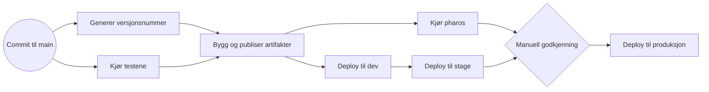

# Matrikkel actions

Dette repoet inneholder gjenbrukbare actions som brukes av bl.a. matrikkelen.

## Actions

### Apps repo deploy [#](./apps-repo-deploy)
Action for å oppdatere gjøre deploy av apper (e.g [Heimdalls Apps Repo](https://github.com/kartverket/heimdall-apps))

### Slack approval notifier [#](./slack-approval-notifier)
Action for å fyre av notifikasjoner til slack for godkjenning av prodsettinger.

### Create PR [#](./create-pr)
Lager er branch, pusher, og oppretter en PR. Kan automatisk merge en PR, men dette krever at repoet den brukes i støtter auto-merge.

## Referanse workflow



```yaml
name: Reference workflow for Heimdall
on:
  push: # Run on every push to every branch
  workflow_dispatch:
    inputs:
      fast-track:
        description: 'Fast track deploy (skip tester)'
        required: false
        type: boolean
        default: false

env:
  CI: true
  TZ: Europe/Oslo
  SLACK_CHANNEL: C09V5AXA4R5 # <slack-channel-id>
  ENVIRONMENT: production
  
concurrency:
  group: ${{ github.ref }} # concurrency group per branch
  cancel-in-progress: true # stop previous runs if new commits happen

defaults:
  run:
    shell: bash

jobs:
  version:
    name: Generate version
    runs-on: ubuntu-latest
    outputs:
      image: ${{ steps.generate_versions.outputs.image }}
      version: ${{ steps.generate_versions.outputs.version }}
    steps:
      - name: Generate version
        id: generate_versions
        run: |
          # Just an example
          version="$(date -u '+%Y.%m.%d-%H.%M')-$(echo "${GITHUB_SHA}" | cut -c1-7)"
          echo "version=${version}" >> "$GITHUB_OUTPUT"
          echo "image=ghcr.io/kartverket/${GITHUB_REPOSITORY}:${version}" >> "$GITHUB_OUTPUT"
  
  test:
    name: Run tests
    if: ${{ !(github.event_name == 'workflow_dispatch' && inputs.fast-track) }}
    runs-on: ubuntu-latest
    steps:
      - uses: actions/checkout@v6
      - uses: actions/setup-java@v5
        with:
          java-version: 21
          java-distribution: 'temurin'
          cache: 'gradle'
  
  package:
    name: Build and (Conditionally) push docker image
    if: ${{ always() && (needs.run-tests.result == 'success' || needs.run-tests.result == 'skipped') }}
    runs-on: ubuntu-latest
    needs:
      - version
      - test
    permissions:
      contents: write # to add git tag to commit
      packages: write # to publish artifact
    steps:
      - uses: actions/checkout@v6
      - uses: docker/login-action@v3
        with:
          registry: ghcr.io
          username: ${{ github.actor }}
          password: ${{ secrets.GITHUB_TOKEN }}
      - uses: docker/build-push-action@v6
        with:
          context: .
          # Only push when on main branch, optionally add support for workflow dispatch
          push: ${{ github.ref == 'refs/heads/main' }} 
          tags: ${{ env.image }}
      - name: Tag commit
        run: |
          git tag ${{ needs.version.outputs.version }}
          git push origin ${{ needs.version.outputs.version }}
          
  pharos:
    name: Run Pharos
    runs-on: ubuntu-latest
    if: github.ref == 'refs/heads/main' # Only run on main branch
    needs:
      - version
      - package
    permissions:
      # As specified by the pharos action
      actions: read
      packages: read
      contents: read
      security-events: write
    steps:
      - name: "Run Pharos"
        uses: kartverket/pharos@v0.5.0
        with:
          image_url: ${{ needs.version.outputs.image }}
          disable_severity_check: true # Remove (defaults to false) for hardening of workflow
          
  deploy-dev:
    name: Deploy to dev
    runs-on: ubuntu-latest
    if: github.ref == 'refs/heads/main'
    needs:
      - version
      - package
    permissions:
      id-token: write # To get OctoSTS token for updating apps-repo
      
    steps:
      - name: Deploy to dev
        uses: kartverket/matrikkel-actions/apps-repo-deploy@main
        with:
          apps: |
            atkv3-dev:matrikkel-main:matrikkel-appname:${{ needs.version.outputs.version }}
    
  deploy-stage:
    name: Deploy to stage
    runs-on: ubuntu-latest
    if: github.ref == 'refs/heads/main'
    needs:
      - version
      - deploy-dev
    permissions:
      id-token: write # To get OctoSTS token for updating apps-repo

    steps:
      - name: Deploy to stage
        uses: kartverket/matrikkel-actions/apps-repo-deploy@main
        with:
          apps: |
            atkv3-prod:matrikkel-betatest:matrikkel-appname:${{ needs.version.outputs.version }}
            atkv3-prod:matrikkel-prodtest:matrikkel-appname:${{ needs.version.outputs.version }}
          
  deploy-prod-notifier:
    name: "Slack Notify: Deployment to production"
    runs-on: ubuntu-latest
    if: github.ref == 'refs/heads/main'
    needs:
      - version       # needs the version reference
      - pharos        # pharos should be OK before we deploy to production
      - deploy-stage  # deployment to stage should be ok
    permissions:
      actions: read   # To read approvals from action
      contents: read  # To get the changelog from previous version
      id-token: write # To get OctoSTS token for getting current deployed version from apps-repo 
    outputs:
      messageId: ${{ steps.slack_notify.outputs.messageId }}
    steps:
      - name: "Slack Notify: Deployment to production"
        id: slack_notify
        uses: kartverket/matrikkel-actions/slack-approval-notifier/setup-octo@main
        with:
          channel: ${{ env.SLACK_CHANNEL }}
          environment: ${{ env.ENVIRONMENT }}
          appDescriptor: atkv3-prod:matrikkel-main:matrikkel-appname:${{ needs.version.outputs.version }}
        env:
          GITHUB_TOKEN: ${{ secrets.GITHUB_TOKEN }}
          SLACK_BOT_TOKEN: ${{ secrets.SLACK_BOT_TOKEN }}

  deploy-prod:
    runs-on: ubuntu-latest
    needs:
      - version
      - deploy-prod-notifier
    environment:
      name: production # Add safeguards to environemtn config in github. E.g require reviews.
    steps:
      - name: "Slack Notify: Deployment to production (Update)"
        uses: kartverket/matrikkel-actions/slack-approval-notifier/update@main
        with:
          channel: ${{ env.SLACK_CHANNEL }}
          environment: ${{ env.ENVIRONMENT }}
          appDescriptor: atkv3-prod:matrikkel-main:matrikkel-appname:${{ needs.version.outputs.version }}
          messageId: ${{ needs.deploy-prod-notifier.outputs.messageId }}
          status: ${{ job.status }}
        env:
          GITHUB_TOKEN: ${{ secrets.GITHUB_TOKEN }}
          SLACK_BOT_TOKEN: ${{ secrets.SLACK_BOT_TOKEN }}
      - name:  Deploy to production
        uses: kartverket/matrikkel-actions/apps-repo-deploy@main
        with:
          apps: |
            atkv3-prod:matrikkel-main:matrikkel-appname:${{ needs.version.outputs.version }}
```